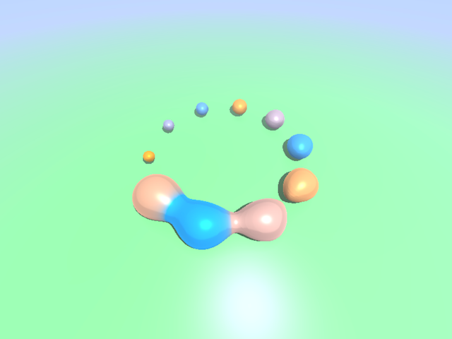

# WebGPU Raymarching

A (really inefficient) WebGPU program that is able to send commands to the
raymarching shader which is executed as a basic stack machine on the shader.

## Related resources

- [Compute byte offsets](https://webgpufundamentals.org/webgpu/lessons/resources/wgsl-offset-computer.html)
  - This helped with determining issues I had with struct padding.
- [Inigo Quilez](https://iquilezles.org/articles/)
  - Great articles on SDFs. I haven't even touched the surface.
